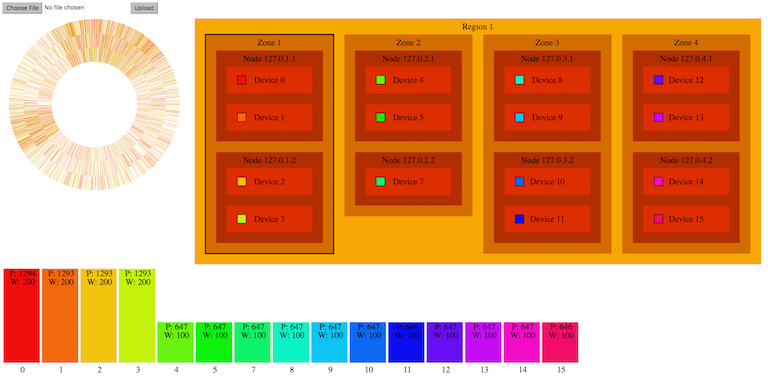

SwiftSense is a simple tool for visualizing OpenStack swift deployment and hash ring. This is still a very early stage
prototype. It is under MIT license. Feel free to fork and hack.



Usage:

```
pip install flask
python app.py
```

Then visit http://127.0.0.1:5000, select your hash ring file and click upload. 
